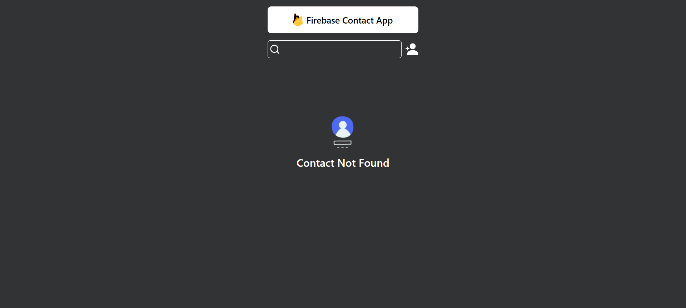

# 📇 Contacts App — React + Vite + Firebase

A modern **Contact Manager** built with [React](https://react.dev/) (Vite) and [Firebase Firestore](https://firebase.google.com/).  
Fast, responsive, and deploy-ready with Vercel.




---
##  Live Demo

🔗 [Click here to try online](https://react-contact-sable.vercel.app/)

## ⚡️ Tech Stack
- React + Vite
- Firebase Firestore
- Tailwind CSS (optional)
- React Icons & React Toastify

## 🚀 Getting Started
```bash
git clone https://github.com/<your-username>/<repo>.git
cd <repo>
npm install
# 📇 Contacts App — React + Vite + Firebase

A minimal contacts manager built with **React (Vite)** and **Firebase Firestore**.

## ⚡️ Tech Stack
- React + Vite
- Firebase Firestore
- Tailwind CSS (optional)
- React Icons & React Toastify

## 🚀 Getting Started
```bash
git clone https://github.com/singhbalendu211/react-contact.git
cd react-contact
npm install

Environment
Fill .env (see .env.example).

Run
npm run dev

Build
npm run build
npm run preview
